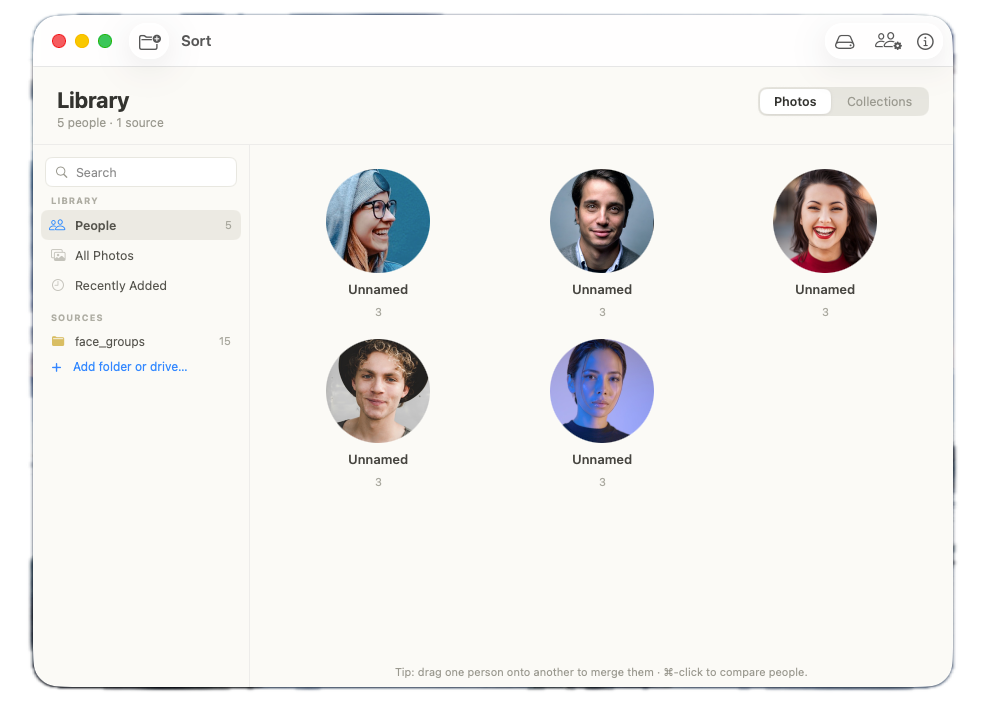
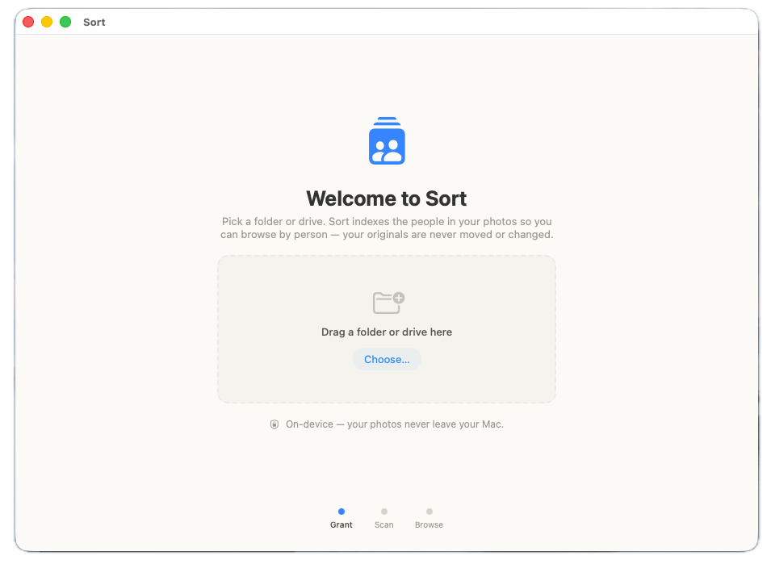
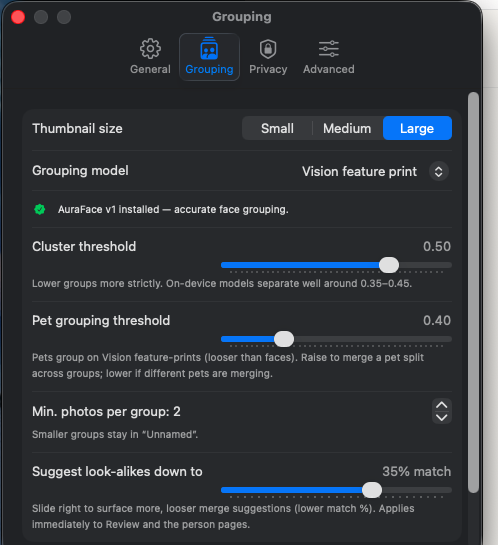

# sort

[](LICENSE)


<p align="center">
  
</p>

Point it at a folder or an external drive and it figures out who's in your photos, then lets you
browse by person. Cats and dogs get their own groups too. It all runs on your Mac — no account, no
cloud, no internet connection.

sort doesn't reorganize anything. Your photos stay where they are, with the same names, in the same
folders; sort keeps its own index alongside them and gives you a better way to look through it all.
When you actually want to tidy up, you can move photos to the Trash (recoverable) or export copies
elsewhere — but that only ever happens when you ask for it.

- **On-device.** Face detection and grouping run locally with Apple Vision and a bundled Core ML
  model. Your photos never leave the machine.
- **Self-contained.** One `.dmg`, no model downloads, no sign-in.
- **Works with what you have.** Regular folders, external SSDs, big messy libraries — point it at any
  of them.

---

## Getting started

Grab the latest `.dmg` from [Releases](../../releases) (one is built automatically for every
version bump), open it, drag **Sort.app** into Applications, launch it, and pick a folder. That's it.

<p align="center">
  
</p>

> [!TIP]
> **macOS will block the first launch.** This build is ad-hoc signed (no paid Apple Developer ID),
> so Gatekeeper says *"Sort" was blocked to protect your Mac* and warns it may contain malware — it
> doesn't; that's just Apple's default stance on unsigned/ad-hoc apps. To open it: **System Settings
> → Privacy & Security → Security**, then click **Open Anyway** next to the Sort warning, and confirm
> in the dialog. Only needed once, on first launch.

Running from source:

```bash
git clone https://github.com/apanjwani0/sort.git && cd sort
swift run sort-app          # builds and launches the app
```

Want your own installer:

```bash
./packaging/make_dmg.sh     # → build/Sort-<version>.dmg  (self-contained, ~118 MB)
```

`make_dmg.sh` builds the app, bundles the face-recognition model, signs it for your Mac, and writes
`build/Sort-<version>.dmg`. Install it with `open build/Sort-*.dmg` and drag onto Applications.

---

## What it does

| | |
|---|---|
| **Browse by person** | Faces are grouped for you. Name people, merge two groups by dragging one onto the other, or pull strays out of a group when it gets something wrong. |
| **Group by pet** | Individual cats and dogs get their own groups (marked with a 🐾), all on-device. |
| **Categories** | Auto-sorted buckets — Screenshots, Documents, Identity & cards (on-device OCR), Places, No faces, Duplicates. |
| **Find duplicates** | Perceptual-hash matching with a side-by-side compare and a "keep the best, trash the rest" shortcut. |
| **Places map** | GPS-tagged photos plotted on a MapKit map. Tap a pin to see what you shot there. |
| **Photo viewer** | Click any photo for a lightbox — zoom, arrow-key through, reveal in Finder, move to Trash. |
| **Trash or export** | Select a batch and either move it to the Trash (recoverable) or copy the originals out to a folder. Either way the originals in place stay untouched. |
| **Gets better as you go** | Every correction you make — same person, different person, not this person — sticks and improves the next round of grouping. |
| **Quick rescans** | Reopening a folder only processes what's new or changed, and people keep their IDs across rescans. |

---

## Requirements

- macOS 15 (Sequoia) or later, on Apple Silicon.
- Building from source needs Xcode 16+ with the Swift 6 toolchain. The dependencies (GRDB.swift and
  swift-argument-parser) are pulled in automatically by SwiftPM.
- Running a prebuilt `.dmg` needs nothing beyond macOS 15+.

---

## Build, test, package

```bash
swift build        # engine (SortKit) + CLI (sort) + app (sort-app)
swift test         # run the test suite
swift run sort-app # build and launch the app
```

Packaging:

```bash
./packaging/make_app.sh     # → build/Sort.app   (sandboxed, runs on this Mac, no Apple account)
./packaging/make_dmg.sh     # → build/Sort-<version>.dmg   (drag-to-Applications installer)
```

Both bundle the AuraFace v1 Core ML model (Apache-2.0) inside the app, so an install needs no extra
download. `CONFIG=debug ./packaging/make_dmg.sh` gives you a faster, unoptimized build.

A heads-up on sharing: local builds run on *your* Mac for free (ad-hoc signed). To hand the `.dmg` to
someone else without a Gatekeeper warning, you need a paid Apple Developer ID ($99/yr) plus
notarization — that path is already wired into `make_dmg.sh` (see the comments in
[`packaging/make_app.sh`](packaging/make_app.sh)). Without paying, a recipient can still open it via
**System Settings → Privacy & Security → Security → Open Anyway** (see the tip above).

---

## Command line

Everything the app does is scriptable through the `sort` CLI:

```bash
swift run sort scan /path/to/photos       # scan and group faces
swift run sort people                      # list people by face count
swift run sort photos <person-id>          # list a person's photos (with photo ids)
swift run sort name <person-id> "Alice"    # name a person
swift run sort faces <photo-id>            # detected face boxes in a photo
swift run sort reclassify                  # sort an existing library into categories
swift run sort delete <photo-id> [--yes]   # move to Trash and drop from the index (recoverable)
```

A few handy options: `--threshold 0.4` on `scan` (lower means stricter grouping),
`--model path/to/arcface.mlmodelc` to use a Core ML embedder, and `--db <path>` on any command to
point at a different index. By default the index lives at
`~/Library/Application Support/sort/index.sqlite`.

---

## How it works

```
grant access → scan (recursive, incremental) → detect faces (Vision) → align + embed (Core ML)
            → cluster into people (stable ids) → SQLite index + thumbnail cache → browse by person
```

There's one engine (`SortKit`) with two front-ends on top of it: the `sort` CLI and the `sort-app`
SwiftUI/AppKit app, so they behave the same.

Grouping quality comes down to the face embedder:

- **Apple Vision feature-print** — the zero-setup default for `swift build` / `swift run`. Decent,
  and needs no model.
- **AuraFace v1 (512-d), Core ML** — Apache-2.0, bundled into the packaged `.app`/`.dmg` for much
  sharper grouping (and commercial-clean, so the DMG is free to redistribute). It's swappable behind
  the `embedding_model` column; ArcFace `buffalo_l` is an optional higher-accuracy swap for personal
  use. More in [docs/MODELS.md](docs/MODELS.md).

Pick the model and tune the clustering yourself in **Settings → Grouping** — cluster/pet thresholds,
minimum group size, and how aggressively to suggest look-alike merges:

<p align="center">
  
</p>

---

## How it treats your files

sort is an index and viewer that sits on top of the photos you already have. It doesn't rename, move,
or edit anything in your folders, and it won't scatter sidecar or thumbnail files next to your
photos — all of its state (the index, embeddings, clusters, thumbnails) lives in the app's own
Application Support directory.

The exceptions are the things you trigger yourself: moving photos to the Trash (recoverable, routed
through a single audited path) and exporting copies out to a folder you pick. Both are covered by
tests (`ReadOnlyInvariantTests`, `TrashTests`).

---

## Project layout

```
Package.swift
Sources/
  SortKit/     engine — Data (GRDB/SQLite), FileAccess, ML (Vision/Core ML), Clustering, IndexService
  sort/        CLI (swift-argument-parser)
  SortApp/     SwiftUI + AppKit macOS app
Tests/SortKitTests/
packaging/     make_app.sh · make_dmg.sh · Info.plist · entitlements
tools/         convert_arcface_to_coreml.py  (ArcFace ONNX → Core ML)
docs/          ARCHITECTURE.md · DECISIONS.md · MODELS.md
```

For the deeper stuff: [docs/ARCHITECTURE.md](docs/ARCHITECTURE.md) for the design and
[docs/DECISIONS.md](docs/DECISIONS.md) for the technical choices and why they were made.

---

## Contributing

Contributions are welcome. The one invariant to respect: sort never edits, renames, or writes to a
file inside a scanned source folder in place — see [CONTRIBUTING.md](CONTRIBUTING.md) for the
details and how to get set up.

---

## License

The source code is [MIT](LICENSE).

One caveat worth reading: the MIT license covers the **code only** — bundled model weights come with
their own licenses. The packaged `.app`/`.dmg` ships **AuraFace v1**
([Apache-2.0](https://huggingface.co/fal/AuraFace-v1)), which is commercial-clean and free to
redistribute. A plain `swift build` with no model falls back to Apple Vision, which has no such
restriction. ArcFace `buffalo_l` is an optional higher-accuracy swap but is **non-commercial**
(personal use only), so don't attach a buffalo_l-bundled DMG to a public release. EdgeFace is
non-commercial too (CC BY-NC-SA), so it's not a commercial option either. Details in
[docs/MODELS.md](docs/MODELS.md).
